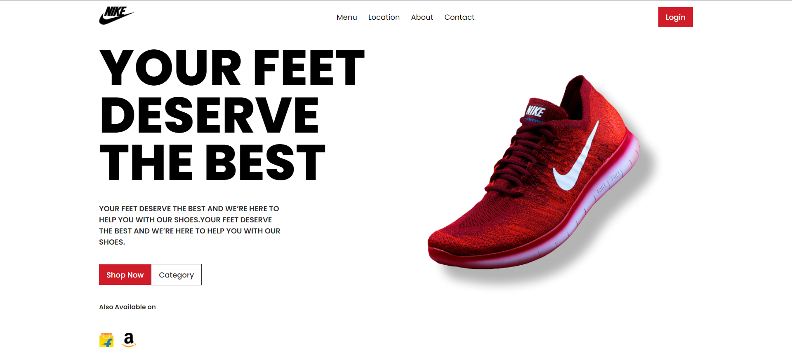

# SHOE BRAND Landing Page (React)

A modern, responsive landing page for a fictional shoe brand, built with **React**. This project is designed to help beginners grasp the basics of component-based design, layout management, and working with React.

---

## 🚀 **Preview**



---

## 📚 **Table of Contents**

1. [Features](#features)
2. [Technologies Used](#technologies-used)
3. [Installation](#installation)
4. [Usage](#usage)
5. [Learnings](#learnings)
6. [License](#license)

---

## 🌟 **Features**

- **Header**: Displays the brand name and navigation links.
- **Hero Section**: A bold, eye-catching banner with a clear call to action.
- **Product List**: Showcases a few sample shoe products with images and descriptions.
- **Footer**: Provides essential brand information and links to social media.

---

## 🛠 **Technologies Used**

- **React**: A powerful JavaScript library for building user interfaces.
- **CSS**: Used for styling and layout design.
- **HTML**: For the foundational structure of the components.

---

## 🛠️ **Installation**

To set up and run this project locally, follow these steps:

1. **Clone the repository**:
   ```bash
   git clone https://github.com/your-username/shoe-brand-landing.git
   
2. **Install the dependencies**:
   ```bash
   npm install

5. **Start the development server**
   ```bash
   npm start

---

## 💻 **Usage**

- You can **customize** the content in each section (Header, Hero Section, Product List, Footer) by modifying the component files located in the `src/components` folder.
- **Styling** can be updated by editing the relevant CSS files or by adding your own styles.

---

## 🧠 **Learnings**

Through this project, you’ll learn:

- How to structure a React application using a **component-based architecture**.
- Basics of **styling** and layout techniques using **CSS**.
- Understanding **React's JSX** syntax for creating dynamic UIs.

